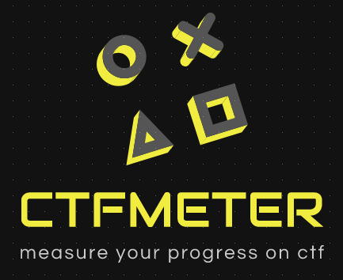
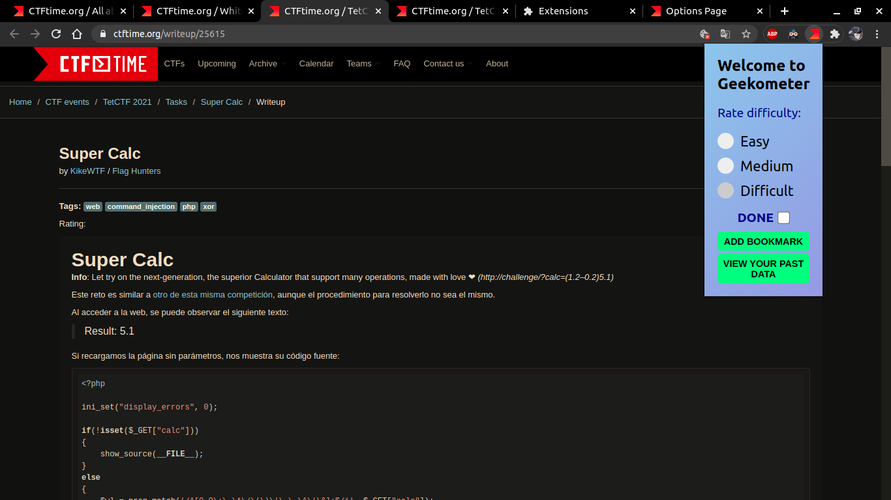
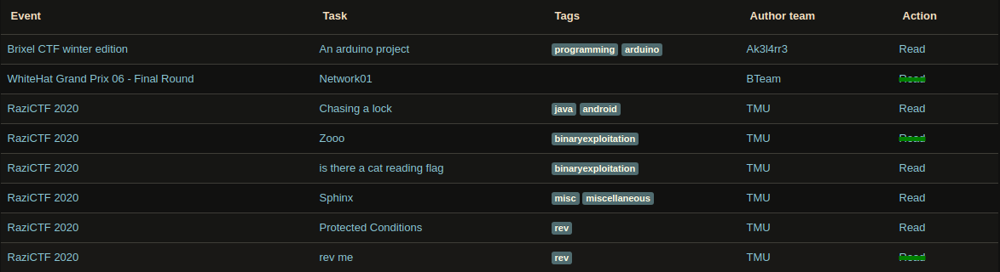
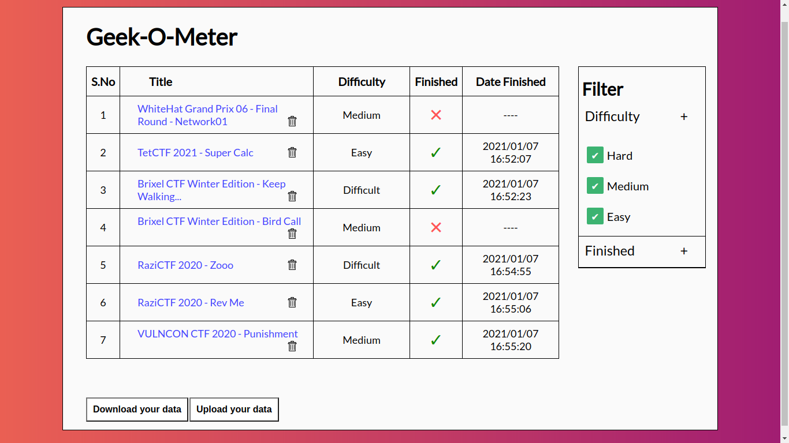
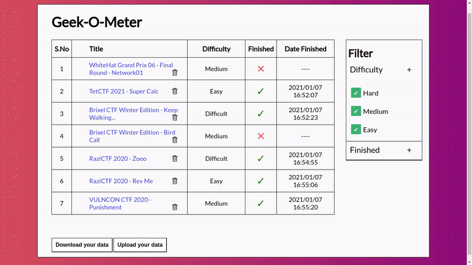
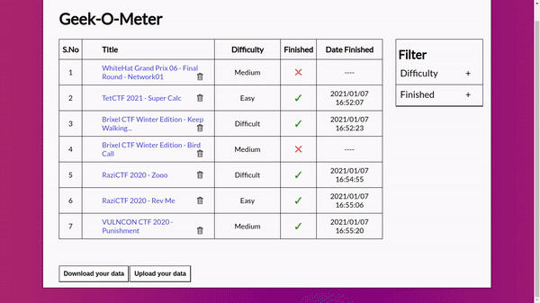
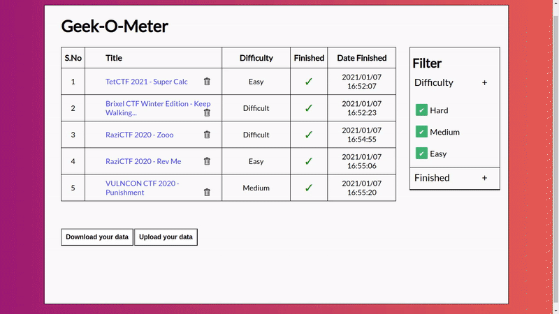
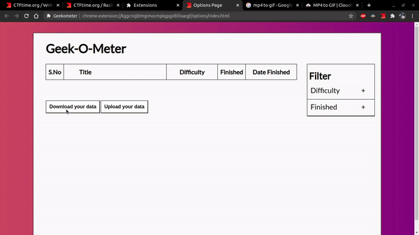

# Geekometer
__Made by group 9__

A extension for tracking the write-ups on [CTF-Time](https://ctftime.org/).

## Adding the Chrome Extension

- Clone/ download the repository.

- Go to [Chrome Extensions ](chrome://extensions)(page)

- Select Load Unpacked Option

- Select the folder where you have cloned the repository.

## Usage

- Go to a CTF Write up on [CTF-Time](https://ctftime.org/) and click on the extension.

- Select the difficulty and click add it to bookmark to add that page to your bookmark.
  
- You can view all the bookmarks by clicking the view your past data.

# Features

1. When Reading the write up of CTFS, you can add the page to bookmarks along with difficulty for future reading.

2. Later when the user is viewing writeups, the completed ones are crossed out.

3. The user can see all the writeups they have bookmarked in a seperate page.

4. They can filter the bookmarks according to the difficulty, or where he has finished it.

5. The user can mark bookmarks as done/ undone or delete this bookmarks page.

6. The user download the data as json, for export to a different desktop.

1. The user upload the data as json, to import the data from the another pc.

# Contributors
- [Senthilnathan](https://github.com/senthil2000-dev)
- [Rahul Nanth](https://github.com/NanthR)
- [Dipesh Kafle](https://github.com/dipeshkaphle)
- [Ajitha Prasad](https://github.com/kelpikz)

